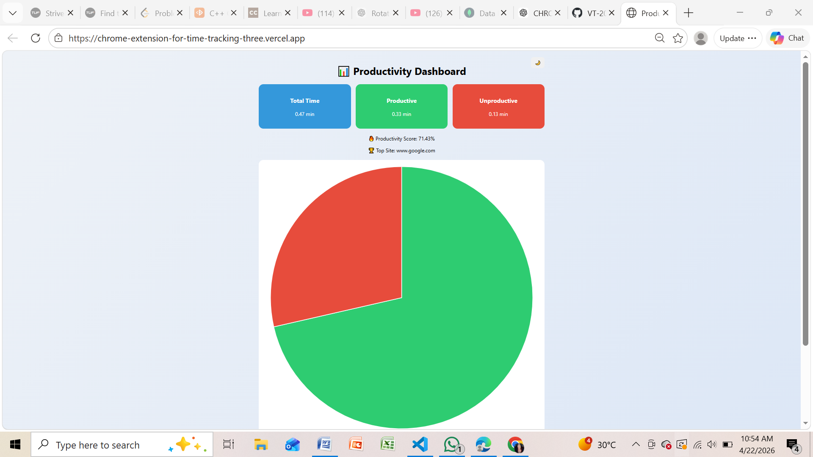
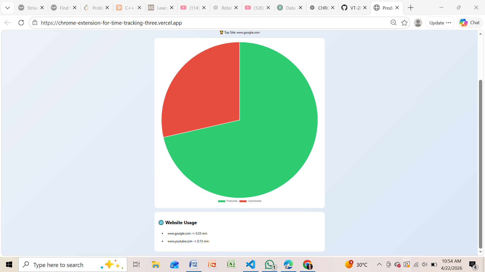

# ⏱ Chrome Extension for Time Tracking & Productivity Analytics

A **full-stack Chrome Extension** that tracks time spent on websites, classifies browsing behavior, and provides **interactive productivity analytics** through a modern dashboard.

---

## 📸 Screenshots

### 📊 Dashboard


### 📈 Pie Chart


---

## 🚀 Features

- ✨ Automatic tracking of time spent on websites  
- 🧠 Smart classification of websites (Productive / Unproductive)  
- 📊 Interactive dashboard with analytics  
- 📈 Pie chart visualization (Productive vs Unproductive)  
- 🔥 Productivity score calculation  
- 🏆 Top website detection  
- 🌙 Dark mode support  
- ⚡ Real-time tab activity tracking  
- 💾 Persistent data storage using MongoDB  
- 📅 Weekly productivity reports  

---

## 🛠 Tech Stack

### 🔹 Frontend (Chrome Extension)
- JavaScript  
- HTML  
- CSS  
- Chrome Extension APIs  

### 🔹 Backend
- Node.js  
- Express.js  
- MongoDB Atlas  
- Mongoose  

### 🔹 Visualization
- Chart.js  

---

## ⚙️ Installation & Setup

### 1️⃣ Clone Repository

```bash
git clone https://github.com/your-username/productivity-tracker.git
cd productivity-tracker
2️⃣ Setup Backend
cd backend
npm install

Create a .env file:

MONGO_URI=your_mongodb_connection_string
PORT=5000

Start server:

node server.js

Server runs at:

http://localhost:5000
3️⃣ Load Chrome Extension
Open Chrome

Go to:

chrome://extensions/
Enable Developer Mode
Click Load Unpacked
Select the extension/ folder
📊 Dashboard Features
📌 Total time tracking
📌 Productive vs Unproductive breakdown
📌 Productivity score (%)
📌 Top visited website
📌 Pie chart visualization
📌 Smooth UI with animations
🔗 How It Works
The extension monitors active tabs using Chrome APIs
Time spent on each website is recorded
Data is sent to a Node.js backend
Backend stores data in MongoDB
Dashboard fetches and visualizes analytics
🧠 Key Highlights
Optimized tracking (records only on tab switch → avoids redundant data)
Clean data handling and filtering

Real-time analytics pipeline

Extension → Backend → Database → Dashboard
Modern UI/UX with animations and dark mode
📁 Project Structure
productivity-tracker/
│
├── backend/
├── extension/
├── dashboard-web/
├── screenshots/
│   ├── dashboard.png
│   ├── piechart.png
│
└── README.md
🧠 Learning Outcomes
Chrome Extension Development
Browser activity tracking
REST API design with Express.js
MongoDB integration with Mongoose
Data visualization using Chart.js
Full-stack system design
🔮 Future Improvements
📊 Bar chart for site-wise analysis
📄 Export analytics as PDF
🤖 AI-based productivity suggestions
☁️ Cloud deployment
📌 Author

Vikas Hanamant Talawar
